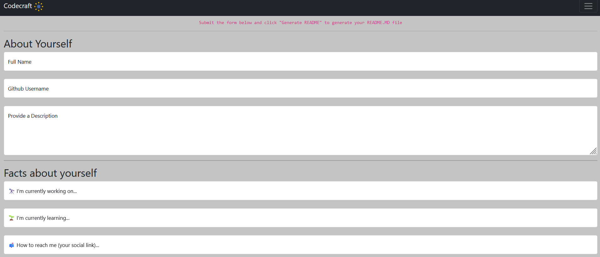
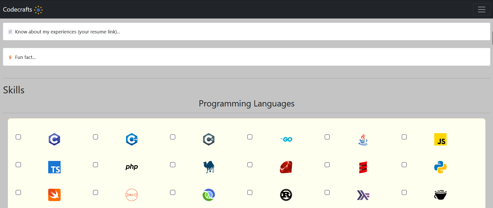
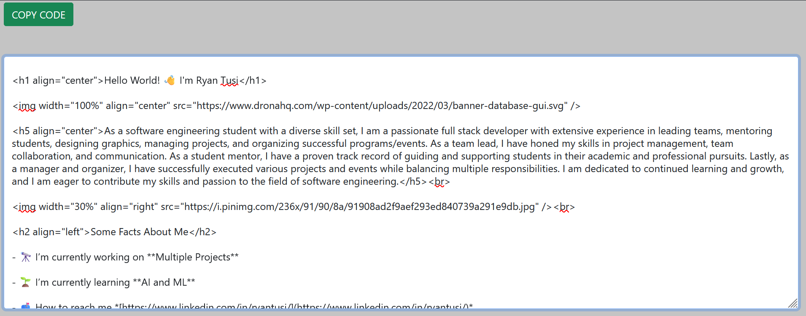
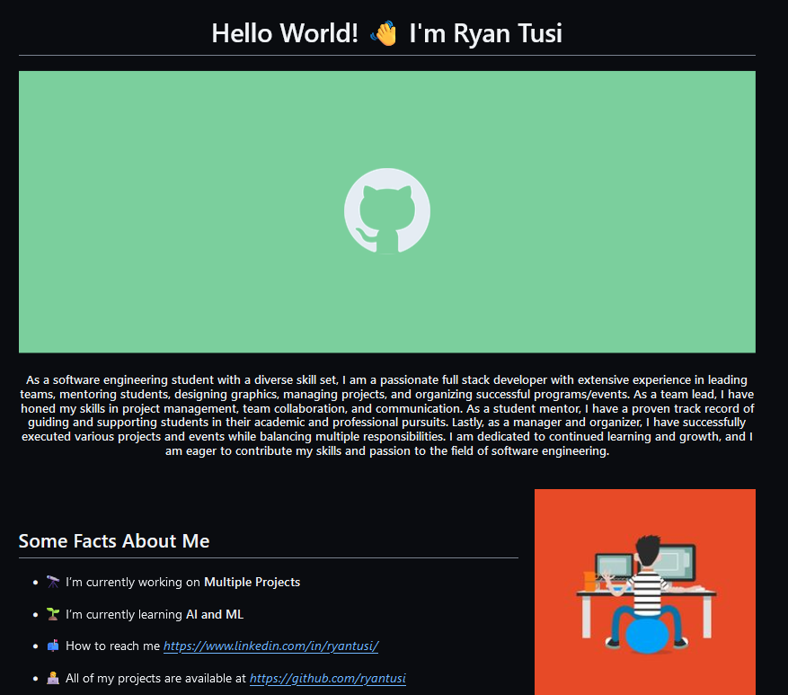

# 👨‍💻 GitHub Profile README Generator

The GitHub Profile README Generator is a web-based tool that empowers users to create dynamic and eye-catching READMEs for their GitHub profiles. The generator allows users to customize their README with various sections, including user description, skills, GitHub stats, trophies, and more. It enables users to showcase their personality and achievements in a visually appealing format.

## 🚀 Features

- **Customizable Sections**: Tailor your profile README with various sections like About Me, Skills, Stats, Trophies, and more.
- **Dynamic Content**: Generate markdown content that dynamically updates based on user preferences and input.
- **Image and Link Integration**: Include images, links, and badges to enhance your profile README.
- **GitHub Stats and Trophies**: Display your GitHub stats and achievements using GitHub API integration.
- **Skill Sets**: Showcase your skillset with out customized svg files.

## 📝 How to Use

1. **Access the Generator**: Visit the [Codecraft](https://your-generator-url.com) website.
2. **Customize Your README**: Select the sections you want to include, provide the necessary details, and customize the appearance.
3. **Generate README**: Click the 'Generate README' button to generate the markdown code for your profile README.
4. **Copy Markdown**: Copy the generated markdown and paste it into your GitHub profile's README.md file.
5. **Commit Changes**: Commit the changes to your GitHub profile to update your README.

## 🖼️ Screenshots

## 💻 Technologies Used

- HTML5
- CSS3
- Bootstrap
- JavaScript
- GitHub API

## 🤝 Contribution

Contributions are welcome! If you have ideas for enhancements or bug fixes, feel free to create issues or pull requests.

## 📄 License

This project is licensed under the [MIT License](LICENSE).

## 🙏 Acknowledgements

This is the final project for CS50 course by Harvard University.

- [Ryan Tusi](https://github.com/ryantusi/) - [Connect with me](https://www.linkedin.com/in/ryantusi/)
- [Harvard CS50](https://pll.harvard.edu/course/cs50-introduction-computer-science)
